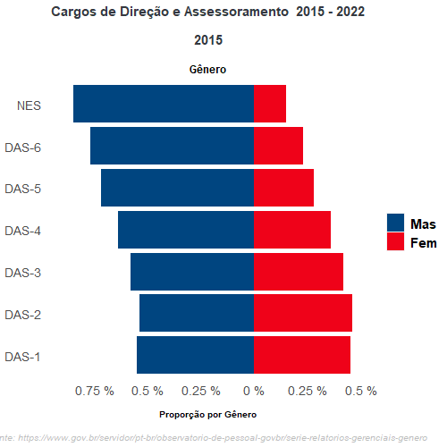
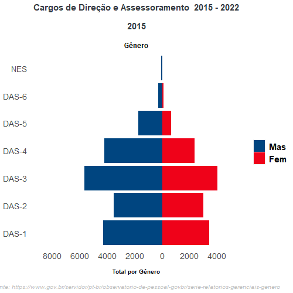

```{r setup, include=FALSE}
knitr::opts_chunk$set(echo = FALSE)
```


```{r library, include=FALSE}
library(clipr)
library(tidyverse)
library(ggpol)
library(gganimate)
library(gifski)
library(kableExtra)

```

## Gif Percentual - 2015 a 2022 

```{r Planilha RLP 9 - Servidores por gênero, echo=FALSE, warning=FALSE}
# Planilha RLP 9 - Servidores por gênero , ctrl c 

#df_percentual <- read_clip_tbl() # Essa função utiliza a area de transferencia 
#readr::write_csv2(df_percentual, "dados/df_perc.csv")

#manipulacao da base

# base_de_dados <- readr::read_csv2("../dados/df_perc.csv", locale = locale(decimal_mark = ",", grouping_mark = "."))
# 
# df <- base_de_dados |> tidyr::pivot_longer(
#   cols = dplyr::starts_with("X"),
#   values_to = "Percentual") |> 
#   dplyr::mutate(
#     Ano = substr(name, 2, 5),
#     # Percentual = readr::parse_number(
#     #   Percentual, locale = locale(decimal_mark = ",", grouping_mark = ".")),
#       Ano = readr::parse_number(Ano),
#     Funcao = as.factor(Funcao),
#     Genero = as.factor(Genero)) |> 
#   dplyr::select(-name) |> 
#   dplyr::mutate(
#     Percentual = ifelse(
#       Genero == 'Mas', Percentual * -1, Percentual
#       )
#     )
# 
# # Alterar os niveis de genero para aparecer na ordem do grafico
# 
# df <- df |> mutate(
#   Genero = factor(Genero, levels = c("Mas", "Fem"))
# )

```

```{r Gráfico Percentual, echo=FALSE, warning=FALSE}
# Gráfico -----------------------------------------------------------------


# grafico <- df %>%
#   ggplot(aes(
#     x = Funcao,
#     y = Percentual,
#     fill = Genero
#   )
#   ) +
#   geom_bar(stat = "identity") +
#   scale_fill_manual(values = c("#004580","#ef0219")) + 
#   scale_y_continuous(breaks=seq(-1,1,0.25),labels=paste0(abs(seq(-1,1,0.25)), " %"))+
#   coord_flip() 
# # +
# #   theme_minimal()
#   # facet_share(
#   #   ~ Genero,
#   #   dir = "h",
#   #   scales = "free",
#   #   reverse_num = TRUE
#  # )
# 
# 
# 
# grafico <- grafico + 
#   labs(
#     title = "Cargos de Direção e Assessoramento  2015 - 2022\n\n{closest_state}",
#     subtitle = "\n\nGênero",
#     y = "\n\nProporção por Gênero",
#     caption = "\n\nFonte: https://www.gov.br/servidor/pt-br/observatorio-de-pessoal-govbr/serie-relatorios-gerenciais-genero"
#   )
# 
# grafico <- grafico + theme(
#   plot.background = element_blank(),
#   axis.ticks = element_blank(),
#   axis.title.y = element_blank(),
#   legend.title = element_blank(),
#   panel.background = element_blank(),
#   panel.border = element_blank(),
#   strip.background = element_blank(),
#   strip.text.x = element_blank(),
#   panel.grid.minor = element_blank(),
#   panel.grid.major = element_blank(), 
#   axis.text = element_text(size = 14),
#   #legend.position = "top",
#   legend.key.size = unit(0.75, "cm"),
#   legend.text = element_text(
#     size = 15,
#     face = "bold"
#   ),
#   plot.title = element_text(
#     size = 15,
#     hjust = 0.5,
#     face = "bold", 
#     colour = "#343a40"
#   ),
#   plot.subtitle = element_text(
#     size = 12,
#     hjust = 0.5,
#     face = "bold"
#   ),
#   axis.title.x = element_text(
#     size = 10,
#     face = "bold"
#   ),
#   plot.caption = element_text(
#     size = 10,
#     hjust = 0.5,
#     face = "italic",
#     color = "gray"
#   )
# )

```

```{r Gif Percentual, echo=FALSE, warning=FALSE}

# grafico <- grafico +
#   transition_states(
#     Ano,
#     transition_length = 1,
#     state_length = 2
#   ) +
#   enter_fade() +
#   exit_fade() +
#   ease_aes('cubic-in-out')
# 
# animate(
#   grafico,
#   fps = 24,
#   duration = 10,
#   width = 500,
#   height = 500,
#   renderer = gifski_renderer("img/perc.gif")
# )
```


```{r gif, echo=FALSE}

```

## GIF Valores Absolutos - 2015 a 2022

```{r Absolutos, echo=FALSE, warning=FALSE}
# Planilha RLP 9 - Servidores por gênero , ctrl c 

# df_abs <- read_clip_tbl() # Essa função utiliza a area de transferencia 
# 
# readr::write_csv2(df_abs, "dados/df_abs.csv")

#manipulacao da base

# base_de_dados <- readr::read_csv2("dados/df_abs.csv", locale = locale(decimal_mark = ",", grouping_mark = "."))


```

```{r base_absoluto, echo=FALSE, warning=FALSE}
# 
# df <- base_de_dados |> tidyr::pivot_longer(
#   cols = dplyr::starts_with("X"),
#   values_to = "Percentual") |>
#   dplyr::mutate(
#     Ano = substr(name, 2, 5),
#     # Percentual = readr::parse_number(
#     #   Percentual, locale = locale(decimal_mark = ",", grouping_mark = ".")),
#       Ano = readr::parse_number(Ano),
#     Funcao = as.factor(Funcao),
#     Genero = as.factor(Genero)) |>
#   dplyr::select(-name) |>
#   dplyr::mutate(
#     Percentual = ifelse(
#       Genero == 'Mas', Percentual * -1, Percentual
#       )
#     )


# Alterar os niveis de genero para aparecer na ordem do grafico

# df <- df |> mutate(
#   Genero = factor(Genero, levels = c("Mas", "Fem"))
# )
```

```{r abs_grafico, echo=FALSE, warning=FALSE}
# Gráfico -----------------------------------------------------------------


# grafico <- df %>%
#   ggplot(aes(
#     x = Funcao,
#     y = Percentual,
#     fill = Genero
#   )
#   ) +
#   geom_bar(stat = "identity") +
#   scale_fill_manual(values = c("#004580","#ef0219")) +
#   scale_y_continuous(breaks=seq(-8000,4500,2000),labels=paste0(abs(seq(-8000,4500,2000))))+
#   coord_flip()
# +
#   theme_minimal()
  # facet_share(
  #   ~ Genero,
  #   dir = "h",
  #   scales = "free",
  #   reverse_num = TRUE
 # )

# grafico <- grafico +
#   labs(
#     title = "Cargos de Direção e Assessoramento  2015 - 2022\n\n{closest_state}",
#     subtitle = "\n\nGênero",
#     y = "\n\nTotal por Gênero",
#     caption = "\n\nFonte: https://www.gov.br/servidor/pt-br/observatorio-de-pessoal-govbr/serie-relatorios-gerenciais-genero"
#   )
# # 
# grafico <- grafico + theme(
#   plot.background = element_blank(),
#   axis.ticks = element_blank(),
#   axis.title.y = element_blank(),
#   legend.title = element_blank(),
#   panel.background = element_blank(),
#   panel.border = element_blank(),
#   strip.background = element_blank(),
#   strip.text.x = element_blank(),
#   panel.grid.minor = element_blank(),
#   panel.grid.major = element_blank(),
#   axis.text = element_text(size = 14),
#   #legend.position = "top",
#   legend.key.size = unit(0.75, "cm"),
#   legend.text = element_text(
#     size = 15,
#     face = "bold"
#   ),
#   plot.title = element_text(
#     size = 15,
#     hjust = 0.5,
#     face = "bold",
#     colour = "#343a40"
#   ),
#   plot.subtitle = element_text(
#     size = 12,
#     hjust = 0.5,
#     face = "bold"
#   ),
#   axis.title.x = element_text(
#     size = 10,
#     face = "bold"
#   ),
#   plot.caption = element_text(
#     size = 10,
#     hjust = 0.5,
#     face = "italic",
#     color = "gray"
#   )
# )
```

```{r gif_absoluto, echo=FALSE, warning=FALSE}
# abs <- grafico +
#   transition_states(
#     Ano,
#     transition_length = 1,
#     state_length = 2
#   ) +
#   enter_fade() +
#   exit_fade() +
#   ease_aes('cubic-in-out')
# 
# animate(
#   abs,
#   fps = 24,
#   duration = 10,
#   width = 500,
#   height = 500,
#   renderer = gifski_renderer("img/abs.gif")
# )

```


```{r gif_abs, echo=FALSE}

```

```{r 2022, echo=FALSE, message=FALSE, warning=FALSE}

base_de_dados <- readr::read_csv2("../dados/df_perc.csv", locale = locale(decimal_mark = ",", grouping_mark = "."))

df <- base_de_dados |> tidyr::pivot_longer(
  cols = dplyr::starts_with("X"),
  values_to = "Percentual") |>
  dplyr::mutate(
    Ano = substr(name, 2, 5),
    # Percentual = readr::parse_number(
    #   Percentual, locale = locale(decimal_mark = ",", grouping_mark = ".")),
      Ano = readr::parse_number(Ano),
    Funcao = as.factor(Funcao),
    Genero = as.factor(Genero)) |>
  dplyr::select(-name) |>
  dplyr::mutate(
    Percentual = ifelse(
      Genero == 'Mas', Percentual * -1, Percentual
      )
    )

# Alterar os niveis de genero para aparecer na ordem do grafico

df <- df |> mutate(
  Genero = factor(Genero, levels = c("Mas", "Fem")),
  Percentual = formattable::percent(Percentual,0)
  ) |> 
  dplyr::filter(Ano == 2022) |> 
  dplyr::rename(`Função` = Funcao , `Gênero` = Genero )
```

## Somente 2022 - Percentual


```{r echo=FALSE, message=FALSE, warning=FALSE}
# Gráfico -----------------------------------------------------------------


grafico <- df %>%
  ggplot(aes(
    x = `Função`,
    y = Percentual,
    fill = `Gênero`
  )
  ) +
  geom_bar(stat = "identity") +
  scale_fill_manual(values = c("#004580","#ef0219")) +
  scale_y_continuous(breaks=seq(-1,1,0.25),labels=paste0(abs(seq(-1,1,0.25)), " %"))+
  coord_flip()
# +
#   theme_minimal()
  # facet_share(
  #   ~ Genero,
  #   dir = "h",
  #   scales = "free",
  #   reverse_num = TRUE
 # )


grafico <- grafico +
  labs(
    title = "Cargos de Direção e Assessoramento - 2022",
    subtitle = "\n\nGênero",
    x="",
    y = "\n\nProporção por Gênero",
    caption = "\n\nFonte: https://www.gov.br/servidor/pt-br/observatorio-de-pessoal-govbr/serie-relatorios-gerenciais-genero"
  ) 

plotly::ggplotly(grafico) |> plotly::layout(yaxis = list(ticksuffix = "%"))

grafico <- grafico + theme(
  plot.background = element_blank(),
  axis.ticks = element_blank(),
  axis.title.y = element_blank(),
  legend.title = element_blank(),
  panel.background = element_blank(),
  panel.border = element_blank(),
  strip.background = element_blank(),
  strip.text.x = element_blank(),
  panel.grid.minor = element_blank(),
  panel.grid.major = element_blank(),
  axis.text = element_text(size = 14),
  #legend.position = "top",
  legend.key.size = unit(0.75, "cm"),
  legend.text = element_text(
    size = 15,
    face = "bold"
  ),
  plot.title = element_text(
    size = 15,
    hjust = 0.5,
    face = "bold",
    colour = "#343a40"
  ),
  plot.subtitle = element_text(
    size = 12,
    hjust = 0.5,
    face = "bold"
  ),
  axis.title.x = element_text(
    size = 10,
    face = "bold"
  ),
  plot.caption = element_text(
    size = 10,
    hjust = 0.5,
    face = "italic",
    color = "gray"
  )
)

```

## Somente 2022 - valores absolutos

```{r abss_2022, echo=FALSE, message=FALSE, warning=FALSE}

base_de_dados <- readr::read_csv2("../dados/df_abs.csv", locale = locale(decimal_mark = ",", grouping_mark = "."))

df <- base_de_dados |> tidyr::pivot_longer(
  cols = dplyr::starts_with("X"),
  values_to = "Percentual") |>
  dplyr::mutate(
    Ano = substr(name, 2, 5),
    # Percentual = readr::parse_number(
    #   Percentual, locale = locale(decimal_mark = ",", grouping_mark = ".")),
      Ano = readr::parse_number(Ano),
    Funcao = as.factor(Funcao),
    Genero = as.factor(Genero)) |>
  dplyr::select(-name) |>
  dplyr::mutate(
    Percentual = ifelse(
      Genero == 'Mas', Percentual * -1, Percentual
      )
    )


# Alterar os niveis de genero para aparecer na ordem do grafico

df <- df |> mutate(
  Genero = factor(Genero, levels = c("Mas", "Fem"))
)|> dplyr::filter(Ano == 2022)|> 
  dplyr::rename(`Função` = Funcao , `Gênero` = Genero, Total = Percentual )

```

```{r graf_2022_abs}
grafico <- df %>%
  ggplot(aes(
    x = `Função`,
    y = Total,
    fill = `Gênero`
  )
  ) +
  geom_bar(stat = "identity") +
  scale_fill_manual(values = c("#004580","#ef0219")) +
  scale_y_continuous(breaks=seq(-8000,4500,2000),labels=paste0(abs(seq(-8000,4500,2000))))+
  coord_flip()
# +
#   theme_minimal()
  # facet_share(
  #   ~ Genero,
  #   dir = "h",
  #   scales = "free",
  #   reverse_num = TRUE
 # )

grafico <- grafico +
  labs(
    title = "Cargos de Direção e Assessoramento - 2022",
    subtitle = "\n\nGênero",
    x= "",
    y = "\n\nTotal por Gênero",
    caption = "\n\nFonte: https://www.gov.br/servidor/pt-br/observatorio-de-pessoal-govbr/serie-relatorios-gerenciais-genero"
  )

plotly::ggplotly(grafico) 
grafico <- grafico + theme(
  plot.background = element_blank(),
  axis.ticks = element_blank(),
  axis.title.y = element_blank(),
  legend.title = element_blank(),
  panel.background = element_blank(),
  panel.border = element_blank(),
  strip.background = element_blank(),
  strip.text.x = element_blank(),
  panel.grid.minor = element_blank(),
  panel.grid.major = element_blank(),
  axis.text = element_text(size = 14),
  #legend.position = "top",
  legend.key.size = unit(0.75, "cm"),
  legend.text = element_text(
    size = 15,
    face = "bold"
  ),
  plot.title = element_text(
    size = 15,
    hjust = 0.5,
    face = "bold",
    colour = "#343a40"
  ),
  plot.subtitle = element_text(
    size = 12,
    hjust = 0.5,
    face = "bold"
  ),
  axis.title.x = element_text(
    size = 10,
    face = "bold"
  ),
  plot.caption = element_text(
    size = 10,
    hjust = 0.5,
    face = "italic",
    color = "gray"
  )
)
```

## Alternativa 

```{r absosultos_2022, echo=FALSE, message=FALSE, warning=FALSE}

#dados valores absolutos

abs <- readr::read_csv2("../dados/df_abs.csv", locale = locale(decimal_mark = ",", grouping_mark = "."))

df1 <- abs |> tidyr::pivot_longer(
  cols = dplyr::starts_with("X"),
  values_to = "Total") |>
  dplyr::mutate(
    Ano = substr(name, 2, 5),
    # Percentual = readr::parse_number(
    #   Percentual, locale = locale(decimal_mark = ",", grouping_mark = ".")),
      Ano = readr::parse_number(Ano),
    Funcao = as.factor(Funcao),
    Genero = as.factor(Genero)) |>
  dplyr::select(-name) |>
  dplyr::mutate(
    Total = ifelse(
      Genero == 'Mas', Total * -1, Total
      )
    )

perc <- readr::read_csv2("../dados/df_perc.csv", locale = locale(decimal_mark = ",", grouping_mark = "."))

df2 <- perc |> tidyr::pivot_longer(
  cols = dplyr::starts_with("X"),
  values_to = "Percentual") |>
  dplyr::mutate(
    Ano = substr(name, 2, 5),
    # Percentual = readr::parse_number(
    #   Percentual, locale = locale(decimal_mark = ",", grouping_mark = ".")),
      Ano = readr::parse_number(Ano),
    Funcao = as.factor(Funcao),
    Genero = as.factor(Genero)) |>
  dplyr::select(-name) |>
  dplyr::mutate(
    Percentual = ifelse(
      Genero == 'Mas', Percentual * -1, Percentual
      )
    )


dados <- dplyr::bind_cols(df1, df2) |> select(Funcao =  Funcao...1, 
                                    Genero = Genero...2,
                                     Ano = Ano...4,  
                                     Total, Percentual
                                     )


# Alterar os niveis de genero para aparecer na ordem do grafico

dados <- dados |> mutate(
  Genero = factor(Genero, levels = c("Mas", "Fem"))
)|> dplyr::filter(Ano == 2022)|> 
  dplyr::rename(`Função` = Funcao , `Gênero` = Genero)
```

```{r alternativa, echo=FALSE, message=FALSE, warning=FALSE}
grafico <- dados %>%
  ggplot(aes(
    x = `Função`,
    y = Total,
    fill = `Gênero`, 
    text =paste("Percentual:", formattable::percent(abs(Percentual), 0)))) +
  geom_bar(stat = "identity") +
  scale_fill_manual(values = c("#004580","#ef0219")) +
  scale_y_continuous(breaks=seq(-8000,4500,2000),labels=paste0(abs(seq(-8000,4500,2000))))+
  geom_label(
    aes(
      y = Total,
      label = formattable::percent(abs(Percentual), 0)   #str_glue("{Percentual} %")
    ),
    size = 3,
    alpha = 0.09, 
    hjust = 0.5
  ) +
  coord_flip() +theme_minimal()

grafico <- grafico +
  labs(
    title = "Cargos de Direção e Assessoramento - 2022",
    subtitle = "\n\nGênero",
    x= "",
    y = "\n\nTotal por Gênero",
    caption = "\n\nFonte: https://www.gov.br/servidor/pt-br/observatorio-de-pessoal-govbr/serie-relatorios-gerenciais-genero"
  )

plotly::ggplotly(grafico)
```

## Etnia


```{r echo=FALSE, message=FALSE, warning=FALSE}
etnia <- readr::read_csv2("../dados/tabula-Historico-Etnia.csv") 

# etnia <- etnia |> dplyr::mutate(
#   `% Pretos Pardos Negros` =formattable::percent(`% Pretos Pardos Negros`, 0)
# )


library(echarts4r)
graf_etnia <- etnia  |> 
  e_charts(x = Data)  |> 
  echarts4r::e_tooltip(
    # formatter = htmlwidgets::JS("function(params){
    #                             return(
    #                             params.value[0] + 
    #                             '<br />'+params.value[1]*100 + '%')}")
    ) |> 
  e_x_axis(Data, axisPointer = list(
    show = TRUE,
    label = list(show = FALSE)
  )) %>%
  e_y_axis(
    nameLocation = "end",
    formatter = e_axis_formatter("percent", digits = 0),
    min = 0.3,
    nameTextStyle = list(
      color = "#666666",
      fontWeight = "bold"
    )) %>%
  #echarts4r::e_theme("gray") %>%
  e_line(`% Pretos Pardos Negros`,  legend = FALSE) %>%
  e_datazoom(show = TRUE, toolbox = FALSE) %>%
  e_axis_labels(y = "Percentual Etnia") |> 
  echarts4r::e_legend(right = 0) |> 
  echarts4r::e_theme_custom('{"color":["#004580","#ef0219"]}') 
  
graf_etnia

```

## PCD

```{r echo=FALSE, message=FALSE, warning=FALSE}
# library(clipr)
# 
# pcd <- clipr::read_clip_tbl() |> janitor::clean_names()

pcd <- readr::read_csv2("../dados/pcd.csv") |>
  dplyr::mutate(
  `% c/Deficiência` = Percentual
)

graf_pcd <- pcd  |>
  e_charts(x = Data)  |>
  echarts4r::e_tooltip(
    # formatter = htmlwidgets::JS("function(params){
    #                             return(
    #                             params.value[0] +
    #                             '<br />'+params.value[1]*100 + '%')}")
    ) |>
  e_x_axis(Data, axisPointer = list(
    show = TRUE,
    label = list(show = FALSE)
  )) %>%
  e_y_axis(
    nameLocation = "end",
    formatter = e_axis_formatter("percent", digits = 0),
    min = 0,
    max = 0.015,
    nameTextStyle = list(
      color = "#666666",
      fontWeight = "bold"
    )) %>%
  #echarts4r::e_theme("gray") %>%
  e_line(`% c/Deficiência`,  legend = FALSE) %>%
  e_datazoom(show = TRUE, toolbox = FALSE) %>%
  e_axis_labels(y = "Percentual PCD") |>
  echarts4r::e_legend(right = 0) |>
  echarts4r::e_theme_custom('{"color":["#004580","#ef0219"]}')

graf_pcd
```

