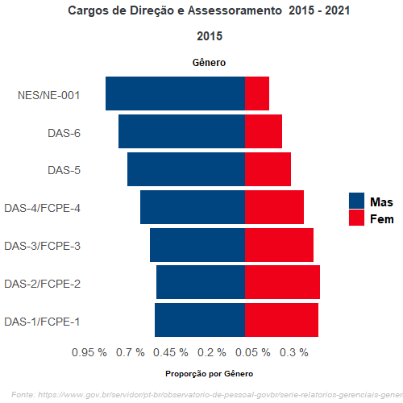

## Sumário Executivo

Segundo o disposto na Convenção nº 111 da Organização Internacional do
Trabalho (OIT), toda distinção, exclusão ou preferência fundada na raça,
cor, sexo, religião, opinião política, ascendência nacional ou origem
social que tenha por efeito destruir ou alterar a igualdade em matéria
de emprego ou profissão é ato discriminatório. Não sendo consideradas
discriminatórias, no entanto, as distinções, exclusões ou preferências
fundadas em qualificações exigidas para um determinado emprego.

Alcançar a igualdade de gênero não é um processo de curto prazo. Exige
grande vontade política e um esforço conjunto por parte de governos,
sociedade civil, organismos internacionais e outros, porém as reformas
legais e regulatórias podem ter um papel fundamental e ser um importante
primeiro passo, conforme disposto em artigo do Banco Mundial. Ainda no
mesmo artigo, a Presidente interina do Grupo Banco Mundial, Kristalina
Georgieva, salienta que os avanços vêm ocorrendo, mas não em um ritmo
rápido o suficiente, e 2,7 bilhões de mulheres ainda enfrentam
impedimentos legais no acesso às mesmas oportunidades de emprego que os
homens e que é primordial que essas barreiras sejam eliminadas.

A Constituição Federal (CF) buscando promover a igualdade entre homens e
mulheres dispõe que constituem objetivos fundamentais da República
Federativa do Brasil: promover o bem de todos, sem preconceitos de
origem, raça, **sexo**, cor, idade e quaisquer outras formas de
discriminação (inciso IV do artigo 3º). Cabe mencionar ainda que em seu
artigo 5º a Constituição menciona que todos são iguais perante a Lei,
sem distinção de qualquer natureza, sendo homens e mulheres iguais em
direitos e obrigações (inciso I).

A seguir, cabe mencionar ainda o disposto no artigo 7º da CF que assim
dispõe:

> "Art. 7º São direitos dos trabalhadores urbanos e rurais, além de
> outros que visem à melhoria de sua condição social: (...)
>
> XXX - proibição de diferença de salários, de exercício de funções e de
> critério de admissão por motivo de sexo, idade, cor ou estado civil;"
> (Grifo nosso)

Tais dispositivos não deixam dúvidas quanto à importância que é dada ao
princípio da Igualdade, sendo considerado como um dos pilares do Estado
Democrático de Direito, que busca repelir a discriminação e o tratamento
desigual entre os cidadãos. A Constituição ratifica esse princípio por
meio de várias normas, algumas diretamente determinadoras da igualdade,
outras buscando a equidade entre os desiguais mediante a concessão de
direitos sociais fundamentais.

## Dados

**Servidores ativos classificados por sexo**

No serviço público, a ocupação de cargos no serviço público por mulheres
têm se mantido estável ao longo do tempo. A seguir, podemos observar o
quantitativo de servidores ativos separados por sexo no Poder Executivo
Federal Civil.

```{r echo=FALSE, warning=FALSE}
library(readxl)
dados <- read_excel("dados/dados.xlsx") |> janitor::clean_names()
knitr::kable(dados)
```

Com base nos dados do gráfico, podemos observar um índice médio em torno
de 45,3% em relação ao quantitativo de mulheres ocupantes de cargos no
serviço público, enquanto o percentual de homens gira em torno de 54,6%
da força de trabalho total. No período de 2010 a 2018, o percentual de
mulheres cresceu pouco, totalizando um aumento de 1,4%, tendo ocorrido
uma queda nos anos de 2019, 2020, 2021 e 2022 de 1,1% em relação ao ano
de 2018.

```{r Percentual, echo=FALSE, message=FALSE, warning=FALSE}
library(tidyverse)
library(echarts4r)
library(lubridate)
library(readxl)
e_common(font_family = "helvetica", theme = "westeros")
grafico1 <- readxl::read_excel("dados/dados.xlsx", sheet = "Planilha7")|> janitor::clean_names()
  

grafico1  |> 
  e_charts(x = ano, timeline = FALSE)  |>  
  e_bar(homens, legend = FALSE) |> 
  e_bar(mulheres, legend = FALSE) |> 
  e_line(percent_mulheres, y_index = 1, legend = FALSE) |> 
  e_line(percent_homens, y_index = 1, legend = FALSE)  |> 
  echarts4r::e_tooltip(trigger = "item") |> # tooltip
  echarts4r::e_title("Ocupação de cargos por sexo", "Poder Executivo Federal") |>  
  echarts4r::e_legend(right = 0)
```


```{r, echo=FALSE,fig.align='center'}

```

Quando comparamos o quantitativo de servidores separados por sexo e por
Unidade da Federação (UF), é possível observar dois Estados que se
destacam quanto ao percentual maior de mulheres em relação ao de homens,
são eles: Amapá, com 51,9% de mulheres e Roraima com 50,9% de mulheres.
No que se refere aos órgãos com o menor percentual de mulheres nos
quadros de pessoal, três Estados também se destacam, quais sejam: Acre,
em que as mulheres ocupam um percentual de 38,4% e Rio Grande do Norte
com 40,3% de mulheres


```{r echo=FALSE}
tabela2 <- read_excel("dados/dados.xlsx", sheet = "Planilha1")

knitr::kable(tabela2)

```

## Servidores ocupantes de cargos e funções

O governo federal publicou a Lei nº 14.204, de 16 de setembro de 2021,
que simplificou a gestão de cargos e de funções de confiança na
Administração Pública Federal, dispondo sobre a instituição dos Cargos
Comissionados Executivos (CCE) e as Funções Comissionadas Executivas
(FCE); a autorização para o Poder Executivo transformar, sem aumento de
despesa, cargos em comissão, funções de confiança e gratificações; e a
simplificação da gestão de cargos em comissão e de funções de confiança.
Posteriormente, foi publicado o Decreto nº 10.829, de 5 de outubro de
2021, por meio do qual a Lei nº 14.204/21 foi regulamentada.

Cabe mencionar ainda o Anexo III da Lei nº 14.204/2021 que menciona que
os cargos em comissão do Grupo-Direção e Assessoramento Superiores (DAS)
existentes na legislação passam a referir-se também aos CCE e às FCE,
conforme disposto a seguir.

```{r echo=FALSE}
tabela3 <- read_excel("dados/dados.xlsx", sheet = "Planilha2")

knitr::kable(tabela3)
```

Em seguida, vamos observar a disposição dos ocupantes de cargos e
funções com características de Direção e Assessoramento divididos por
sexo. Cabe salientar que fazem parte desse conjunto de dados os cargos
de Direção e Assessoramento Superiores (DAS), Funções Comissionadas do
Poder Executivo (FCPE), cargos e funções específicos das Agências
Reguladoras, cargos de direção específicos das Universidades Federais e
dos Institutos do Ensino Básico, Técnico e Tecnológico Federais,
Natureza especial, dentre outros.

```{r, echo=FALSE, results='asis'}
tabela4 <- read_excel("dados/dados.xlsx", sheet = "Planilha3")

knitr::kable(tabela4)
```

É possível observar que o índice médio de ocupação de mulheres girou em
torno de 39,3% entre os anos de 2010 e 2021, enquanto o percentual de
homens foi de 60,6%.

```{r echo=FALSE}
tabela5 <- read_excel("dados/dados.xlsx", sheet = "Planilha4")

knitr::kable(tabela5)
```

Em seguida, vamos desmembrar os dados mencionados no quadro acima,
relacionados, apenas, aos cargos de DAS quanto à ocupação separada por
níveis e por sexo.

```{r echo=FALSE}
tabela6 <- read_excel("dados/dados.xlsx", sheet = "Planilha5")

knitr::kable(tabela6)
```

Os DAS estão estratificados em seis níveis, sendo o nível 6 o mais alto,
ocupado por secretários nacionais e diretores ou presidentes de
autarquias e fundações. Cargos de confiança no setor público são
posições de liderança. Do total de DAS disponibilizados em 2021, as
mulheres ocupavam 43,8%. O quantitativo de ocupação por mulheres é
equivalente ao quantitativo de homens até o nível 3, quando ocupavam
50,3% das posições, enquanto o percentual de homens era de 49,7% no ano
de 2021. Porém, a partir do nível 4, vê-se uma diminuição na
participação das mulheres nos cargos de confiança. Note-se que no nível
6, apenas 22,4% dos cargos são ocupados pelo sexo feminino, sendo o
total de homens de 77,6%. De acordo com o Gráfico nº 5, observa-se que
essa situação não é uma característica de um ponto específico no tempo,
sendo uma configuração que se apresenta de forma consistente ao longo
dos anos.

Vamos observar ainda a disposição dos ocupantes de Funções e
Gratificações Técnicas divididos por sexo. Cabe mencionar que fazem
parte desse conjunto de dados as Funções Gratificadas (FG) dos
Ministérios, Autarquias e Fundações, FG das Universidades e Institutos
Federais, Funções e Gratificações específicos das Agências Reguladoras,
entre outros.

```{r echo=FALSE}
tabela7 <- read_excel("dados/dados.xlsx", sheet = "Planilha6")

knitr::kable(tabela7)
```

Quanto à ocupação de Funções e Gratificações Técnicas, é possível
observar um índice médio de ocupação pelas mulheres entre o ano de 2010
e 2021 em torno de 43,6%; enquanto o de homens foi em torno de 56,3%.

## Fontes e metodologia Base de Dados

A fonte primária para a obtenção das informações apresentadas é o
Sistema Integrado de Administração de Pessoal (SIAPE) e o Painel
Estatístico de Pessoal (PEP), no
[**link**](http://painel.pep.planejamento.gov.br)

Outras fontes:

[**Convenção
OIT**](http://www.planalto.gov.br/ccivil_03/_Ato2019-2022/2019/Decreto/D10088.htm#art5)

[**Banco
Mundial**](https://www.worldbank.org/pt/news/press-release/2019/02/27/despite-gains-women-face-setbacks-in-legal-rights-affecting-work)

[**Constituição
Federal**](http://www.planalto.gov.br/ccivil_03/constituicao/constituicao.htm)

## Revisões

A revisões são realizadas anualmente, conforme necessário, como
resultado de atualização de base de dados.

## Institucional

Eduardo Bergamaschi Felizola - Secretário

Antônio Fuiza de Sousa Landim -- Diretor

Mirian Lucia Bittencourt Guimarães -- Coordenadora-Geral

Equipe técnica

-   Luana Correa Silva Rodrigues

## Contato

Coordenação-Geral de Informações Gerenciais -- CGINF

Departamento de Soluções Digitais e Informações Gerenciais -- Ministério
da Economia

Esplanada dos Ministério, Bloco C, 9º andar, sala 940

70297-400 -- Brasília/DF

Tel: (61) 2020-1179 E-mail:
[sgp.cginf\@economia.gov.br](mailto:sgp.cginf@economia.gov.br){.email}


## Origem Étnica

```{r , echo=FALSE, message=FALSE, warning=FALSE}
e_common(font_family = "helvetica", theme = "westeros")
formatar_numero_br <- function(serie) {
  htmlwidgets::JS(
    glue::glue(
      "function(params) {return Intl.NumberFormat('pt-BR', { style: 'decimal'}).format(params.value[{{serie}}]);}",
      .open = "{{",
      .close = "}}"
    )
  )
}

tab_final <- readxl::read_excel("dados/Mulheres_FINAL v2.xlsx", sheet = "FINAL")|> janitor::clean_names()
  
tab_final |>
  count(Etnia = cor_origem_etnica, name = "Qtde")|> 
  arrange(desc(Qtde)) |> 
  e_charts(x = Etnia, timeline = FALSE)  |>  
  e_bar(Qtde, legend = FALSE) |> 
  e_tooltip("item") |>
  #e_tooltip(formatter = formatar_numero_br(1)) |>
  e_labels(fontSize = 12,
           distance = 10,
           formatter = formatar_numero_br(1)) |> # tooltip
  echarts4r::e_title("Origem Étnica - Sexo Feminino", "Poder Executivo Federal") |>  
  #echarts4r::e_legend(right = 0) |> 
  echarts4r::e_locale(locale = "PT-br") |> 
  e_format_y_axis(
    suffix = "",
    prefix = "",
    formatter = e_axis_formatter(locale = "PT", digits = 0)
  ) |> 
  e_x_axis(axisLabel = list(rotate = 45))
```

## PCD

```{r, echo=FALSE, message=FALSE, warning=FALSE}
tab_final |>
  count(PCD = pcd, name = "Qtde")|> 
  arrange(desc(Qtde)) |> 
  e_charts(x = PCD, timeline = FALSE)  |>  
  e_bar(Qtde, legend = FALSE) |> 
  e_tooltip("item") |>
  #e_tooltip(formatter = formatar_numero_br(1)) |>
  e_labels(fontSize = 12,
           distance = 10,
           formatter = formatar_numero_br(1)) |>
  echarts4r::e_title("PCD - Sexo Feminino", "Poder Executivo Federal") |>  
  #echarts4r::e_legend(right = 0) |> 
  e_format_y_axis(
    suffix = "",
    prefix = "",
    formatter = e_axis_formatter(locale = "PT", digits = 0)
  )
  
```

## Estado Civil

```{r, echo=FALSE, message=FALSE, warning=FALSE}
tab_final |>
  count(`Estado Civil` = estado_civil , name = "Qtde")|> 
  arrange(desc(Qtde)) |> 
  e_charts(x = `Estado Civil`, timeline = FALSE)  |>  
  e_bar(Qtde, legend = FALSE) |> 
  e_tooltip("item") |>
  #e_tooltip(formatter = formatar_numero_br(1)) |>
  e_labels(fontSize = 12,
           distance = 10,
           formatter = formatar_numero_br(1)) |>
  echarts4r::e_title("Estado Civil - Sexo Feminino", "Poder Executivo Federal") |>  
  #echarts4r::e_legend(right = 0) |> 
  e_format_y_axis(
    suffix = "",
    prefix = "",
    formatter = e_axis_formatter(locale = "PT", digits = 0)
  )
```


## Escolaridade

Talvez criar uma categoria outras e renomear 

```{r, echo=FALSE, message=FALSE, warning=FALSE}
tab_final |>
  count(Escolaridade = escolaridade , name = "Qtde")|> 
  arrange(Qtde) |> 
  e_charts(x = Escolaridade, timeline = FALSE)  |>  
  e_bar(Qtde, legend = FALSE) |> 
  e_tooltip("item") |>
  e_labels(fontSize = 12,
           distance = 10,
           position = "inside",
           formatter = formatar_numero_br(0)) |>
  echarts4r::e_title("Escolaridade - Sexo Feminino", "Poder Executivo Federal") |>  
  #echarts4r::e_legend(right = 0) |> 
  e_x_axis(axisLabel = list( fontSize = 8)) |> 
  e_format_y_axis(
    suffix = "",
    prefix = "",
    formatter = e_axis_formatter(locale = "PT", digits = 0)
  ) |> 
  e_flip_coords() 
  #e_x_axis(axisLabel = list(rotate = 90))
```


## Quantidade de Filhos

```{r, echo=FALSE, message=FALSE, warning=FALSE}
tab_final |>
  count( Filhos = as.factor(qtd_filhos_menores_de_idade) , name = "Qtde")|> 
  arrange(desc(Qtde)) |> 
  e_charts(x = Filhos, timeline = FALSE)  |>  
  e_bar(Qtde, legend = FALSE) |> 
  e_tooltip(formatter = formatar_numero_br(1)) |>
  e_labels(fontSize = 12,
           distance = 10,
           formatter = formatar_numero_br(1)) |>
  echarts4r::e_title("Nº de Filhos", "Poder Executivo Federal") |>  
  #echarts4r::e_legend(right = 0) |> 
  e_format_y_axis(
    suffix = "",
    prefix = "",
    formatter = e_axis_formatter(locale = "PT", digits = 0)
  )
```

## Idade

```{r, echo=FALSE, message=FALSE, warning=FALSE}
tab_final |>
  count(`Faixa etária` = faixa_etaria_3 , name = "Qtde")|> 
  arrange(Qtde) |> 
  e_charts(x = `Faixa etária`, timeline = FALSE)  |>  
  e_bar(Qtde, legend = FALSE) |> 
  e_tooltip("item") |>
  e_labels(fontSize = 12,
           distance = 10,
           position = "inside",
           formatter = formatar_numero_br(0)) |>
  echarts4r::e_title("Faixa Etária - Sexo Feminino", "Poder Executivo Federal") |>  
  #echarts4r::e_legend(right = 0) |> 
  e_x_axis(axisLabel = list( fontSize = 8)) |> 
  e_format_y_axis(
    suffix = "",
    prefix = "",
    formatter = e_axis_formatter(locale = "PT", digits = 0)
  ) |> 
  e_flip_coords() 
  #e_x_axis(axisLabel = list(rotate = 90))
```

## Remuneração

```{r, echo=FALSE, message=FALSE, warning=FALSE}
tab_final |>
  count( `Remuneração` = formattable::currency(
    remun, big.mark = ".", symbol = "R$ ") , name = "Qtde")|> 
  arrange(desc(Qtde)) |> 
  e_charts()  |>  
  e_histogram(`Remuneração`, legend = FALSE) |> 
  e_tooltip("item") |>
  #e_tooltip(formatter = formatar_numero_br(1)) |>
  e_labels(fontSize = 12,
           distance = 10,
           formatter = formatar_numero_br(1)) |>
  echarts4r::e_title("Remuneração - Sexo Feminino", "Poder Executivo Federal") |>  
  #echarts4r::e_legend(right = 0) |> 
  e_format_y_axis(
    suffix = "",
    prefix = "",
    formatter = e_axis_formatter(locale = "PT", digits = 0)
  ) |> 
  e_format_x_axis(
    suffix = "",
    prefix = "R$") 
  
```